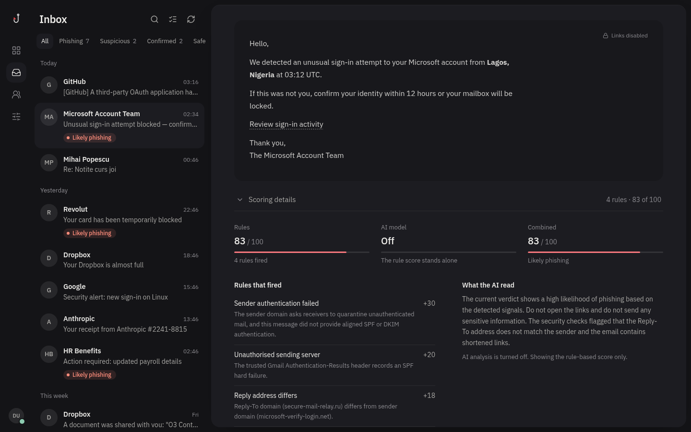
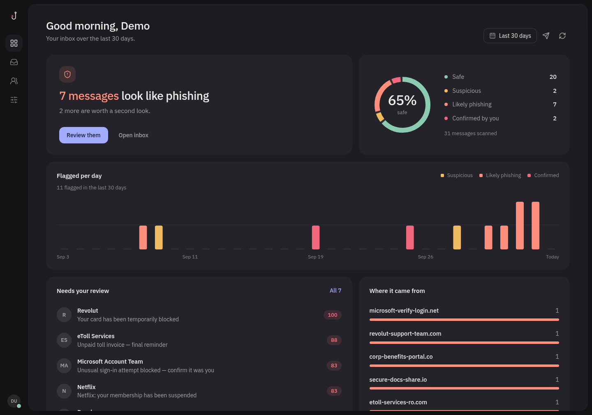
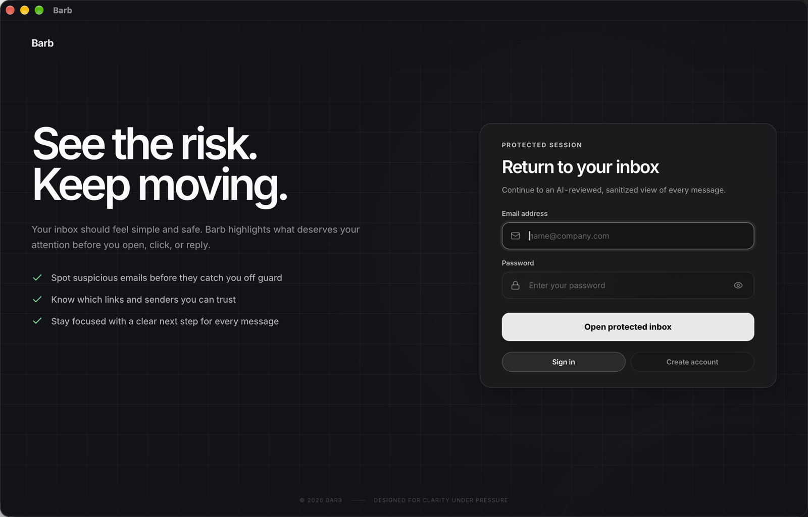
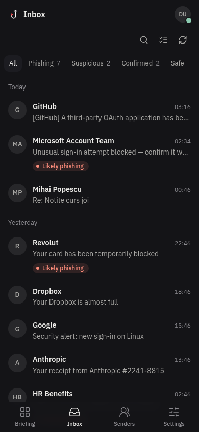
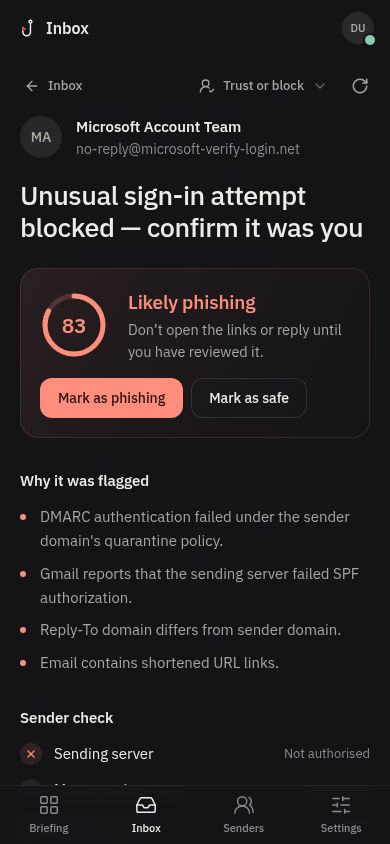
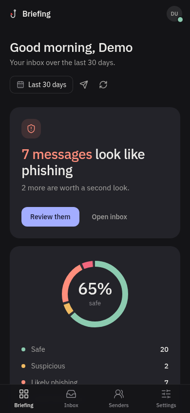

<p align="center">
  
</p>

<h1 align="center">Barb</h1>

<p align="center">
  <b>See the hook before you bite.</b><br />
  Phishing triage for Gmail that shows its work.
</p>

<p align="center">
  <a href="https://secure-inbox.app/install">Install</a> ·
  <a href="https://secure-inbox.app/inbox">Open in the browser</a> ·
  <a href="docs/detection-engine.md">How detection works</a>
</p>

<p align="center">
  
</p>

Most filters tell you a message is suspicious and stop there. Barb tells you why: the DMARC check that failed, the reply-to that points somewhere else, the link that's already on URLhaus. Every rule that fires shows up next to the message with the points it added, so you can check the reasoning instead of trusting a number.

## What it looks at

- **Who sent it.** SPF, DKIM, DMARC and ARC, checked against the raw message and live DNS. A spoofed "Microsoft" can't outscore the real one.
- **Where the links go.** Every redirect hop, Google Web Risk, URLhaus, and how old the domain is.
- **What's attached.** Files are read by content, not by name: macros, encrypted zips, PDFs that run something on open. Nothing touches disk.
- **How it's worded.** A local model (Ollama) gives a second opinion. It can never call a message phishing on its own.

You stay in charge. Mark a message safe, confirm it as phishing (Barb moves it to Spam), or trust and block senders. Barb reads your mail and never sends from your account.

One honest caveat: Barb hasn't been measured against a labeled dataset yet, so there are no precision or recall numbers. Treat it as a sharp second pair of eyes.

<table>
  <tr>
    <td></td>
    <td></td>
  </tr>
  <tr>
    <td align="center">The briefing: your last 30 days at a glance</td>
    <td align="center">The Mac app</td>
  </tr>
</table>

<p align="center">
  
  
  
</p>

## Get it

**Mac** (Apple Silicon). Paste into Terminal:

```bash
curl -fsSL https://secure-inbox.app/install.sh | sh
```

**iPhone.** Open [secure-inbox.app](https://secure-inbox.app) in Safari, tap Share, then Add to Home Screen.

**Anywhere else.** It's a web app: [secure-inbox.app](https://secure-inbox.app/inbox).

## Run your own

You need Docker and OpenSSL.

```bash
git clone https://github.com/AndreiStolojan/SecureInbox.git
cd SecureInbox
./provision
```

Open http://localhost:8080 and sign in as `demo@secureinbox.test` (the password is in `.env`). Six demo messages are already seeded, so you can poke around before connecting Gmail.

Connecting Gmail, the optional threat feeds, backups and the rest are in the [self-hosting guide](docs/self-hosting.md). The production instance runs on a Raspberry Pi; that setup is in [raspberry-pi-deployment.md](docs/raspberry-pi-deployment.md).

## Under the hood

React and Vite in front, Express and MongoDB behind, nginx in between, Ollama on the side if you want it. The Mac app is a small Tauri shell around the same frontend. Each detection signal is its own provider with its own weights, so one that fails or times out never blocks a scan. The details are in [architecture.md](docs/architecture.md) and [detection-engine.md](docs/detection-engine.md).

(The repo is still called SecureInbox. The app got a better name.)

## Contributing

PRs are welcome. Small fixes can go straight to a pull request; for bigger changes, open an issue first so we can agree on the shape. Good places to start:

- a phishing email Barb got wrong (send the headers and the verdict, not the whole message),
- a new detection signal,
- the Android app, which doesn't exist yet.

[CONTRIBUTING.md](CONTRIBUTING.md) has the setup and the checks to run. Found a security issue? Please report it privately, see [SECURITY.md](SECURITY.md).

## License

[MIT](LICENSE). Built by [Andrei Stolojan](https://github.com/AndreiStolojan) · [LinkedIn](https://www.linkedin.com/in/andrei-stolojan/).
